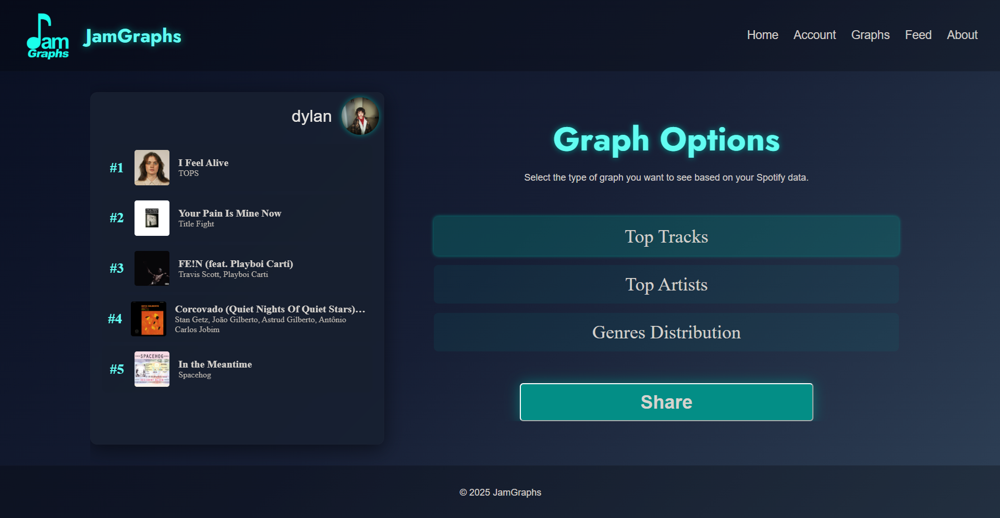
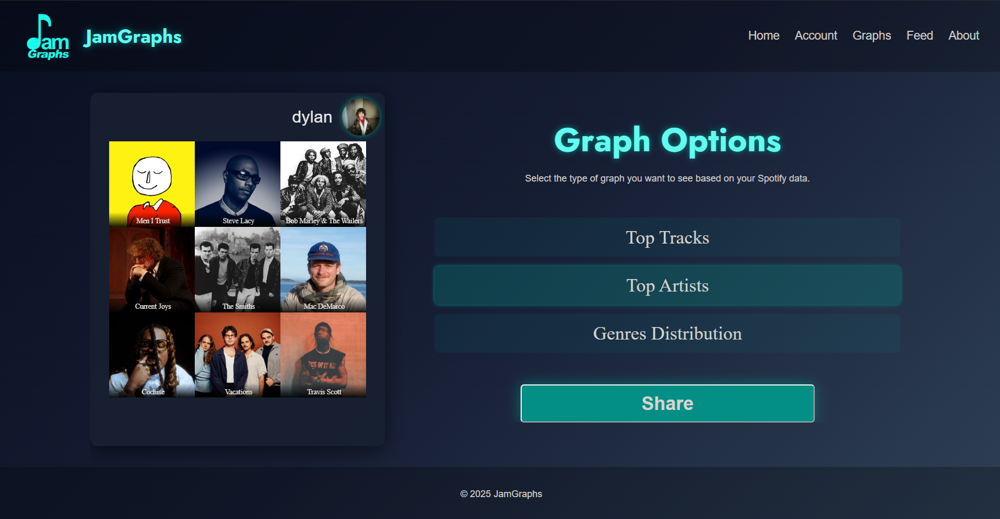
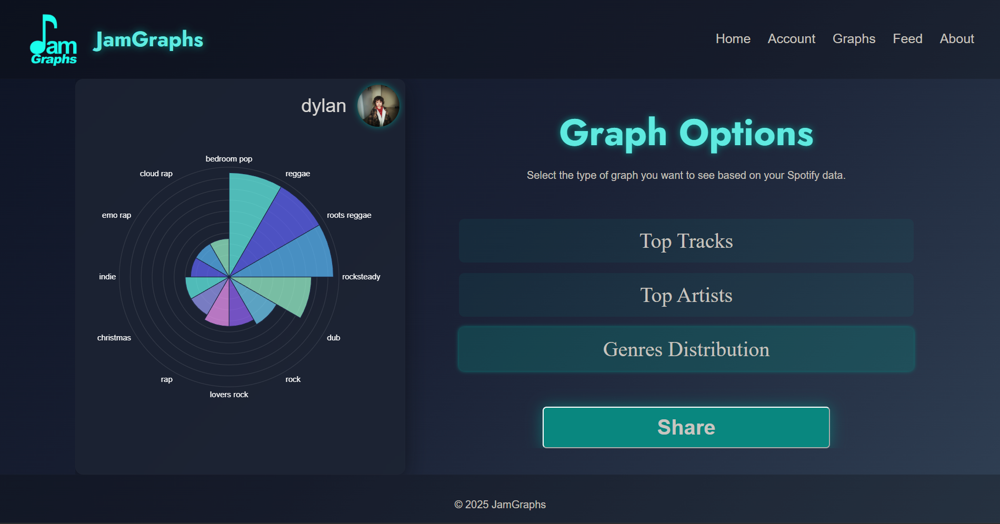
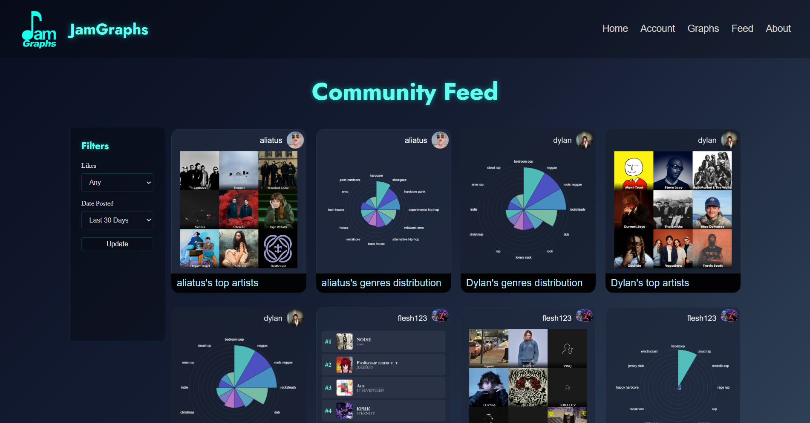
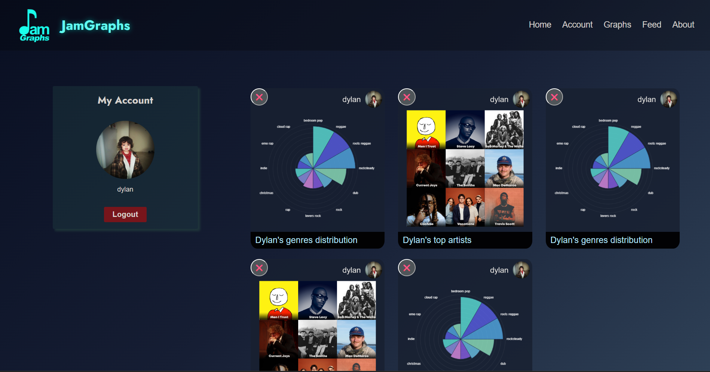

# JamGraphs 

## What is JamGraphs?
JamGraphs is a web-based application which allows users to turn their Spotify listening data into insightful data-driven graphs.

## Project Overview
JamGraphs was built from a love for music and a desire to explore real-world API integration and client-side data visualization. 
The project focuses on retrieving user-specific Spotify listening data, processing it on the server, and presenting it through dynamic, interactive charts.

## Tech Stack
- Frontend: HTML, CSS, EJS (server-side templating)
- Backend: Node.js with Express for routing and server-side rendering
- APIs: Spotify Web API
- Data Formats: JSON
- Visualization: Chart.js
  
## Key Features 
- Dynamic graph creation based on users' own Spotify data
- Server-side templating via EJS for reusable and easily-UI components
- Interactive data visualizations using Chart.js
- OAuth-based Spotify authentication

# Sample Photos 
### Main Landing Page 

### Graph Creation Page (3 Available Graphs)

### Community Feed 

### User Account

## My Personal Contributions
- Developed the Community Feed page in its entirety, where I:
  - Developed several EJS template views for the feed, filters, and posts themselves
  - Implemented logic for filtration of user posts within the community feed based on *date posted* with a prepared implementation for *likes* in the future. 
- Co-developed the styling of the overall application, making a host of changes across CSS styling and HTML design. 
- Contributed to naming, overall design, and feature planning for the application

## Startup Guide (locally):
1. Clone the repo
2. Install dependencies: `npm install`
3. Add your personal Spotify account data to userData.json - this is a requirement due to the developer-test environment/setup the project currently utilizes. 
4. Start the app: `npm run start`
5. Open http://127.0.0.1:8000 and login with your Spotify account.

### Credits
Built collaboratively with Dylan Keyhantaj, Pavlo Kinyshcuk, Akiranandhan Reddy Jaklapally, and Tiernan Flanagan-Caldwell.

